# 2015 - Software Project
```
 ‶공항의 처리능력을 가늠할 수 있는 활주로의 연간용량 산정은 장래 공항계획 수립을 위한 필수적인 작업이다.
 하지만 현재 실무에서는 FAA에서 제시한 산정식을 적용하여 연간용량을 산정하고 있으나, 변수에 대한 명확한 정의가
 이루어지고 있지 않아 사용자의 해석에 따라 상이한 결과값이 도출될 가능성이 있으며, 항공기의 지연이 고려되지
 않는다는 점에서 실무적 제약이 내재되어 있다. 이러한 실무적 한계를 개선하기 위한 방법으로, 본 논문에서는
 미시적 항공교통 시뮬레이션 모형을 활용하여 활주로를 이용하는 항공기의 평균 지연시간을 측정하고, 이를 기준으로
 제주국제공항 활주로의 일일용량을 분석, 최종적으로 연간용량을 산정하는 방법을 소개하였다.″
- 항공기 지연시간을 고려한 제주국제공항 활주로 연간용량 산정, 대한교통학회지

 3. 과업의 목적 및 배경
ㅇ 제주공항의 항공수요가 급격히 증가함에 따라, 단기․중기적으로 활주로 용량을 증대할 수 있는 방안을 도출하고,
ㅇ 도출된 방안에 대한 Airside 통합 시뮬레이션을 실시하여 용량 증대효과를 검증하기 위함.
- 제주공항 Airside 통합 시뮬레이션 분석 용역 과업지시서, KAC 한국공항공사
```

2학년 2학기 전공 과목 중 하나인 소프트웨어 프로젝트 과목에서 자바 GUI로 구현한, 이륙과 착륙이 가능한 2개의 활주로와 이륙 및 긴급 착륙이 가능한 1개의 활주로가 있을 때 각 활주로들의 용량을 비슷하게 유지시키면서 비행기들의 이륙/착륙을 모의 실험하는 프로그램입니다. 사고와 긴급 착륙이 존재하며 시뮬레이션이 끝날 경우 모든 비행기의 이륙/착륙의 평균 대기 시간, 사고/긴급 착륙 비율 등 통계를 계산하여 출력합니다. 사용 규칙에 따라 활주로 간 비행기 공유가 있을 수 있으므로 공유 메모리를 구현하였고 시간(tick)마다 진행 상황을 표시해야 하므로 스레드를 사용하였습니다.<br>

# Definition (Original)
문제 명세서에 제시된 활주로의 수와 사용 규칙은 다음과 같습니다.
<br>
### <비행기 이착륙_ 활주로 수 및 사용규칙>
### 활주로 상황
- 활주로의 수 : 3개 (활주로1, 활주로2, 활주로3)
- 활주로의 역할 : 1,2번은 이착륙 모두 가능, 3번은 이륙 전용이나 긴급 착륙 가능
- 대기 큐 : 착륙을 위한 큐는 1,2번 활주로에 각 2개씩 총 4개가 있고, 이륙을 위한 큐는
	1,2,3번 활주로에 각각 1개씩 총 3개가 있음
### 활주로 사용 규칙
- 도착비행기는 4개의 착륙 큐 중 하나에 들어가며, 큐들은 가능한 비슷한 크기를 유지하도록 한다.
- 착륙 큐에 들어가는 비행기에는 두 가지의 데이터가 부여된다. 하나는 비행기의 고유
	식별자(짝수인 정수)이고, 하나는 제한 시간을 표시하는 정수이다. 각 비행기는 제한된
	연료를 가지고 있고 연료가 허락하는 만큼만 큐에 머물 수 있다. 즉, 제한 시간이 0이
	되기 전에 착륙해야 한다. 남은 연료량과 시간 단위당 연료 소모량을 이용해 매 시간
	단위당 제한 시간의 값을 수정한다.
- 3개의 이륙 큐에 들어가는 비행기는 홀수인 고유 식별자를 할당받으며, 각 이륙 큐들은
	거의 같은 크기로 유지되어야 한다.
- 각 단위 시간마나 0\~3대의 비행기가 착륙 큐에 도착할 수 있고, 이륙 큐에도 0\~3대의
	비행기가 도착할 수 있다. 각 활주로는 매 시간 단위당 하나의 이륙이나 착륙만을 처리
	할 수 있다. 활주로 3은 비행기의 연료가 부족한 경우를 제외하고는 이륙에만 사용된다.
	각 단위 시간 동안 착륙 큐에 있는 비행기 중에 체공 가능 시간이 0에 도달한 비행기에는
	다른 이착륙 비행기들보다 높은 우선순위가 부여된다. 어느 한 비행기에 이와 같은 상황이
	발생하면 활주로3을 사용한다. 만일 2대 이상이면 다른 활주로도 사용한다. 활주로가
	3개이므로 매 단위 시간당 최대 3대의 비행기만 이와 같은 긴급 착륙을 할 수 있다.
<br>

# Definition (Additional)
명세서 이외에 프로그램 구현에 필요한 별도의 제약 사항은 다음과 같습니다<br>
<code>
- 사고 비율이라는 것은 프로그램 측면에서 봤을 땐 하나의 데이터에 불과하지만 실제 상황에서는 큰 인명 피해를 불러올 수 있는 참사이므로 <b>비행기 사고는 전체 착륙 요청 비행기에서 0.5% 미만의 비율로 발생</b>하도록 지정.<br>
- 긴급 착륙 또한 일어나선 안 될 일이므로 <b>긴급 착륙 비행기는 전체 착륙 요청 비행기에서 4% 미만의 비율로 발생</b>하도록 지정.
- Enqueue 확률을 사용자가 직접 입력하게 하며, 이때 사용자가 입력한 x%의 확률로 1/~3대의 비행기가 Enqueue되도록 한다. 즉 1/~3대의 비행기는 각각 (x/3)%의 확률로 큐에 Enqueue된다.
- 착륙 큐에 비행기가 Enqueue될 시 각 비행기의 연료량은 20~80 사이의 난수로 결정한다.
- 착륙 큐에 비행기가 Enqueue될 시 각 비행기의 체공 가능 시간은 (저장된 연료량/2)로 계산한다.
- 단위 시간이 지날 때마다 착륙 큐를 검사하여 체공 가능 시간을 1씩 감소하고, 체공 가능 시간이 0이 되면 우선 순위를 최상위로 변경한 후 긴급 착륙 큐로 비행기를 이동시킨다.
- 만약 체공 시간이 0이 된 후 단위 시간 1분이 지날 때까지 착륙을 하지 못하면 사고로 처리한다.
</code>

# Solution
### (1) pseudo code
- 관제탑 의사 코드<br>
```	
while (입력 시간 동안)
{
	if (활주로 스레드가 시작되지 않았다면)
		스레드 객체를 생성 후 시작
	else
	{
		if (스레드 시간이 0분이 아니면서 10의 배수일 때)
		{
			중간 결과값을 출력함
		}
		x%의 확률로 이/착륙 비행기가 생성
		(이때 비행기는 1~3대가 생성)
		if (생성된 이륙 비행기가 0대가 아니라면)
		{
			1번 활주로, 2번 활주로, 3번 활주로의 크기를 비교
			가장 크기가 작은 활주로에 넣어줌
		}
		if (생성된 착륙 비행기가 0대가 아니라면)
		{
			1번 활주로의 1번/2번 착륙 큐의 크기 합과
			2번 활주로의 1번/2번 착륙 큐의 크기 합 비교 후
			크기가 작은 활주로로 들어가며, 그 중에서도 크기가 제일 작은 착륙 큐에 넣어줌
		}
		1/주어진 시간(초)동안 잠을 잔다
		스레드 시간을 1 증가시킨다
	}
}
```
<br>
- 1,2번 활주로 의사 코드<br>

```
while(입력 시간 동안)
{
	if (착륙 큐의 크기가 0이 아니라면)
	{
		관제탑으로부터 이륙/착륙 비행기를 Enqueue받는다
		착륙 큐 안에 있는 비행기들의 연료량과 비행 가능 시간을 재조정한다
		착륙 큐를 검사한다
		if (착륙 큐 안에 긴급 착륙 비행기가 있다면)
		{
			긴급 착륙 비행기가 발생하였다는 메시지를 발생시키고
			긴급 착륙 비행기들 중가장 먼저 착륙을 요청한 한 대의 비행기를 공유 메모리로 보낸다
		}
		if (착륙 큐 안에 사고 비행기가 있다면)
		{
			사고 처리 메시지를 띄우고 큐에서 지운다
		}
		if (긴급 착륙 비행기가 어떤 큐에 들어왔다면)
		{
			그 큐에 대한 Dequeue를 수행
		}
		else
		{
			1~3사이의 난수를 결정
			switch(난수)
			case 1:
				이륙 큐에 대한 Dequeue를 수행
				if (이륙 큐에 대기 비행기가 없으면)
					1번 착륙 큐의 Dequeue를 수행
				else if(1번 착륙 큐에도 대기 비행기가 없으면)
					2번 착륙 큐의 Dequeue를 수행
				else
					Dequeue 실행 안 함
				break;
			case 2:
				1번 착륙 큐에 대한 Dequeue를 수행
				if (1번 착륙 큐에 대기 비행기가 없으면)
					2번 착륙 큐의 Dequeue를 수행
				else if (2번 착륙 큐에도 대기 비행기가 없으면)
					이륙 큐의 Dequeue를 수행
				else
					Dequeue 실행 안 함
				break;
			case 3:
				2번 착륙 큐에 대한 Dequeue를 수행
				if (2번 착륙 큐에 대기 비행기가 없으면)
					이륙 큐의 Dequeue를 수헹
				else if (이륙 큐에도 대기 비행기가 없으면)
					1번 착륙 큐의 Dequeue를 수행
				else
					Dequeue 실행 안 함
		}
		1/입력 배수(초)만큼 잠을 잔다
		스레드 시간 1 증가
	}
}
```
<br>
- 3번 활주로 의사 코드<br>

```
while(입력 시간 동안)
{
	관제탑으로부터 이륙/착륙 비행기를 Enqueue받는다
	if (공유 메모리 클래스에 긴급 착륙 비행기가 들어왔다면)
	{
		긴급 착륙 비행기 1대를 큐로 얻어옴
	}
	Dequeue를 수행한다
	스레드 시간 1 증가
}
```
<br>
- 공유 메모리 의사 코드<br>

```
if (긴급 착륙 비행기가 들어올 경우)\n
{\n
	if (1번 활주로 1번 착륙 큐일 경우)
	{
		공유 메모리 행렬 (0,0) 자리에 넣는다
		공유 메모리 boolean 행렬 (0,0) 자리를 true로 변경
	}
	else if (1번 활주로 2번 착륙 큐일 경우)
	{
		공유 메모리 행렬(1,0) 자리에 넣는다
		공유 메모리 boolean 행렬 (0,0) 자리를 true로 변경
	}
	else if (2번 활주로 1번 착륙 큐일 경우)
	{
		공유 메모리 행렬(0,1) 자리에 넣는다
		공유 메모리 boolean 행렬 (0,1) 자리를 true로 변경
	}
	else if (2번 활주로 2번 착륙 큐일 경우)
	{
		공유 메모리 행렬(1,1) 자리에 넣는다
		공유 메모리 boolean 행렬 (1,1) 자리를 true로 변경
	}
}
else if (긴급 착륙 비행기가 나갈 경우)
{
	if (긴급 착륙 비행기가 한 대라면)
	{
		긴급 착륙 비행기를 3번 활주로로 전달
	}
	else if (긴급 착륙 비행기가 4대라면)
	{
		한 대는 3번 활주로로 전달 후
		2번 활주로 2번 착륙 큐의 비행기를 사고 처리하고
		나머지는 각각 왔던 큐로 되돌려보냄
	}
	else if (긴급 착륙 비행기가 2,3대라면)
	{
		한 대는 3번 활주로로 전달 후
		나머지는 각각 왔던 큐로 되돌려보냄
	}
}
```
<br>
- 착륙 큐 검사 의사 코드<br>

```
if (큐의 사이즈가 0이 아니고 현재 인덱스!=큐 사이즈일 경우)
{
	for (i=0; i<착륙 큐 사이즈; i++)
	{
		if (i번째 인덱스의 비행 가능 시간이 1분이면)
		{
			해당 비행기를 긴급 착륙 큐로 보내줌
			루프 탈출
		}
	}
	for (i=0; i<착륙 큐 사이즈; i++)
	{
		if (연료량이 2 미만이면)
		{
			해당 비행기를 사고 처리
		}
	}
}
```
<<<<<<< HEAD
<br>
### (2) UML
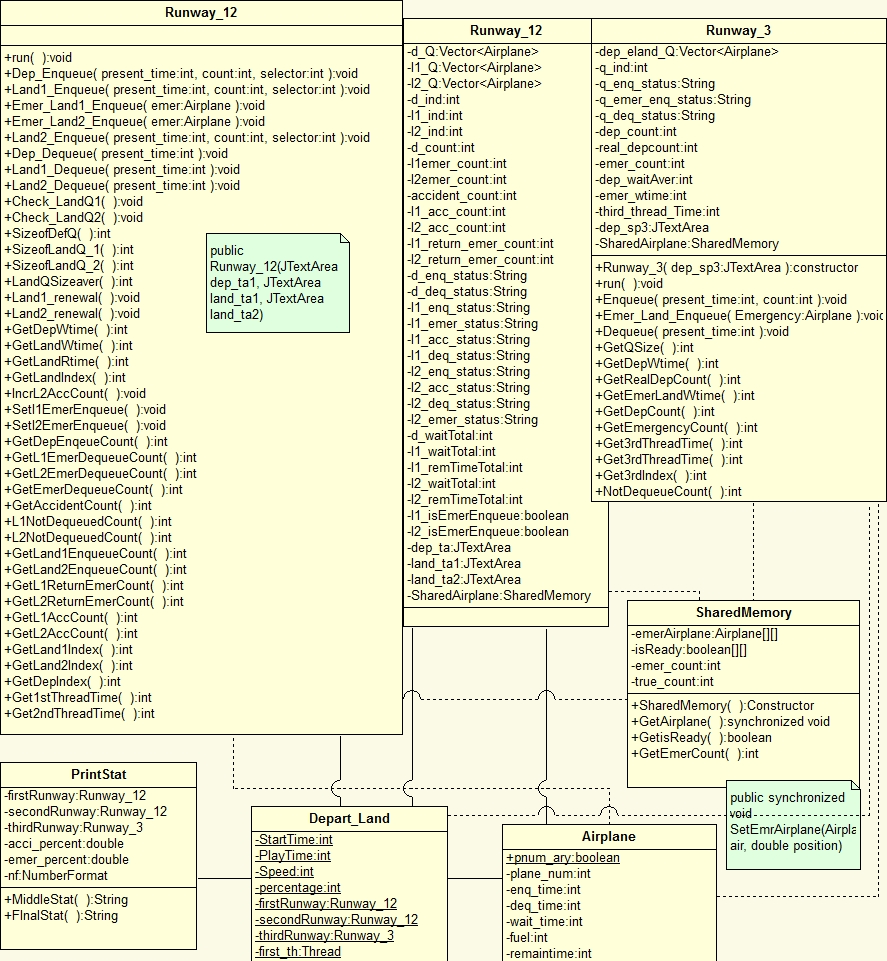
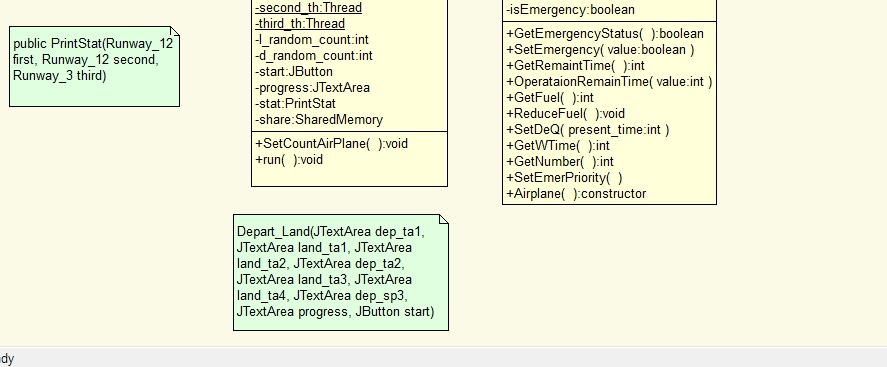
<br>

### (3) Function flow chart
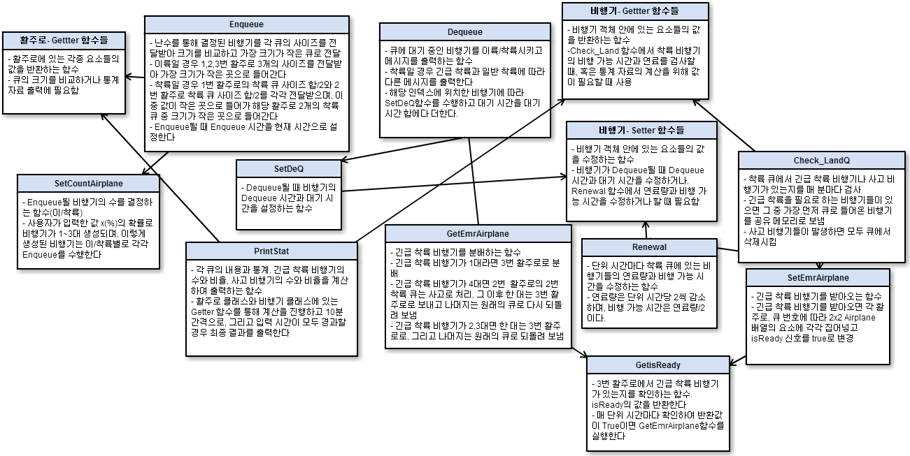

# Result
### (1) Program UI
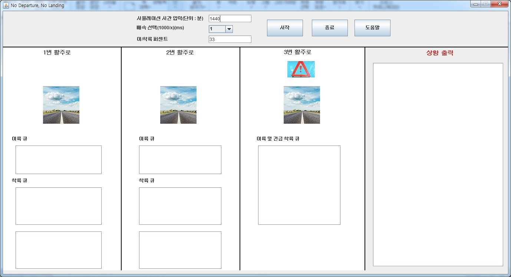
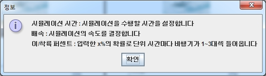
<br>
초기 화면과 도움말입니다 <br>

### (2) Exception Processing

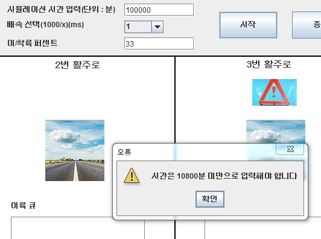
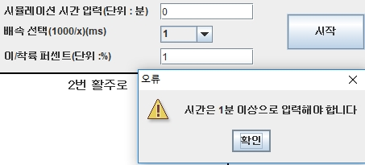
<br>
여러 스레드를 사용하므로 하나의 스레드보다 필요한 데이터 공간이 많이 필요하기 때문에 입력 시간에 제한을 두지 않으면 메모리가 부족한 현상이 발생할 수 있습니다. 또는, 공유 메모리로 인한 시간 차이가 불가피하고, 시간이 커지면 커질수록 이 격차는 더 커지기 때문에 최대 10800분까지의 시간을 입력할 수 있도록 했습니다. 또한 최소 1분 이상은 진행되어야 하므로 이에 대한 처리도 했습니다<br>
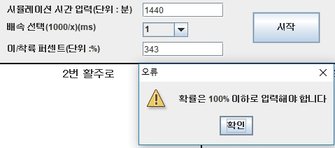
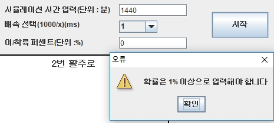
<br>
확률 또한 1/~100%의 범위어야 하므로 이에 대한 예외 처리도 구현했습니다.<br>
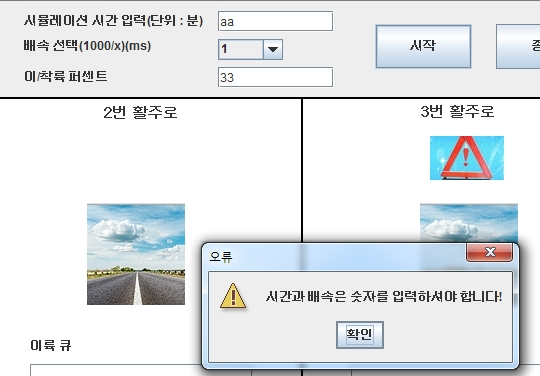
<br>
숫자가 아닌 다른 타입의 값을 입력할 경우의 예외 처리도 구현했습니다.<br>

### (3) Result Window (각 5회 수행 후 평균치)

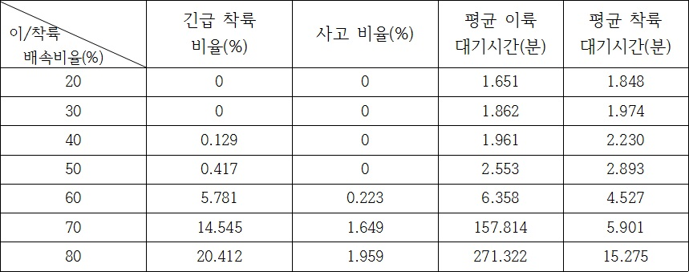
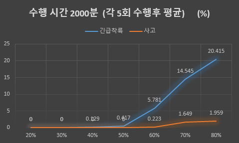
<br>
위에서 정의한 사고/긴급 착륙 확률을 만족하는 최대 확률을 찾기 위한 실험 결과입니다. 최적의 %는 58%로 결정되었습니다. 50% 이후로 확률이 올라갈수록 이륙 대기 시간이 급격하게 증가하는 것을 볼 수 있는데 이는 <b>3번 활주로에 긴급 착륙 비행기가 지속적으로 들어가 기존에 대기하던 이륙 비행기의 대기 시간이 큰 폭으로 증가하였기 때문</b>으로 유추할 수 있습니다.<br>
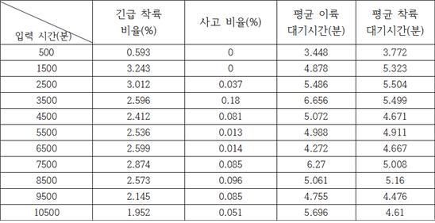
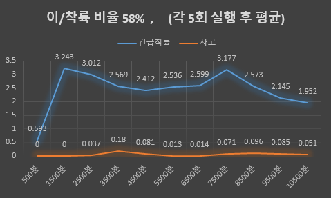
<br>58%의 확률로 시뮬레이션을 구동했을 때 시간 차이에 따른 실험 결과입니다. 시간과 상관없이 비슷한 비율을 보일 것이라는 예상과 크게 벗어나지 않았습니다.
